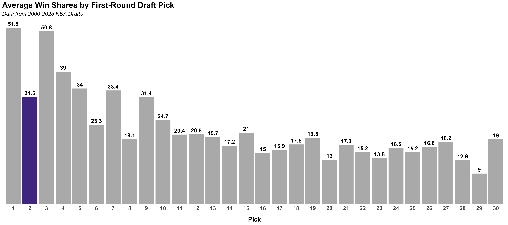
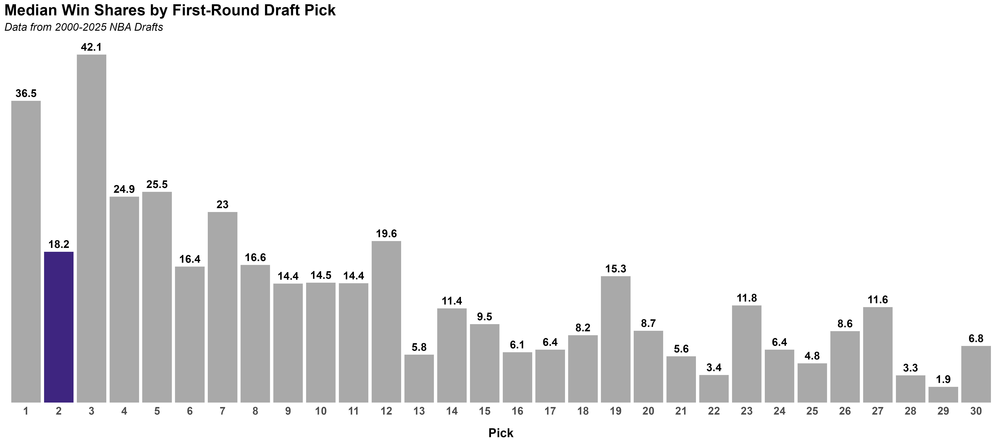

Since landing the second overall pick, there's been a new sense of excitement amongst Jazz fans. Not only will we be adding an elite talent on June 23, but he will be joining an already deep, young, and talented roster. However, the questions remains: what is the true value of a second overall pick and is the "second pick curse" real? Let's take a look at the history of second overall picks to find out.

To get a sense on the value of a second overall pick, I looked at the win shares of all first-round picks since 2000. For a full picture, I looked at average win shares by pick as well as median win shares by pick. The average win shares by pick is a good way to get a sense of the overall value of a pick, while the median win shares by pick is a good way to get a sense of the typical value of a pick:

 

::: {.panel-tabset}

### Average Win Shares

### Median Win Shares

:::

 

As shown, there are some immediate concerns regarding second overall picks. With an average of 31.5 win shares, second overall picks have the lowerst average win shares of any pick in the top 5 and share a near equal average win share with the ninth overall pick. Alarmingly, the average win shares of the second overall pick pale in comparison to the first overall pick (51.9 win shares) and the third overall pick (50.8). 

Median win shares do not provide much more optimism. With a median win shares of 18.2, the second overall pick is closer to median value of picks six through 12 than picks in the top five. In fact, the median win shares of the second pick are less than half of the median win shares of the first pick (36.5) and the third pick (42.1).

Keep in mind, these numbers intentionally include all picks since 2000, which includes some recent picks that have not had the chance to reach their full potential. Additionally, average win shares can be skewed by outliers. However, the data clearly provides some signs of truth to the "second pick curse".