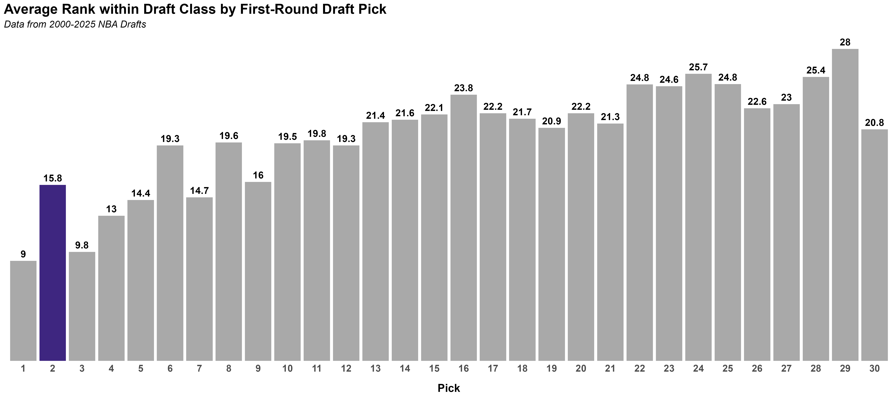
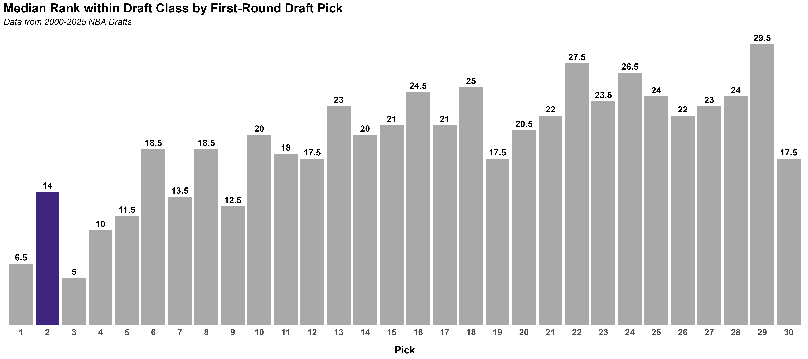
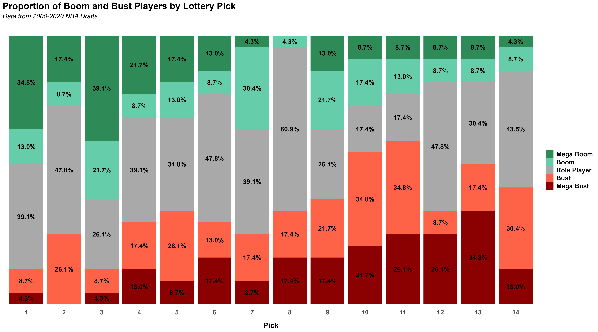

Since landing the second overall pick, there's been a new sense of excitement amongst Jazz fans. Not only will we be adding an elite talent on June 23, but he will be joining an already deep, young, and talented roster. However, the questions remains: what is the true value of a second overall pick and is the "second pick curse" real? Let's take a look at the history of second overall picks to find out.

To get a sense on the value of a second overall pick, I looked at the win shares of all first-round picks since 2000. For a full picture, I looked at average win shares by pick as well as median win shares by pick. The average win shares by pick is a good way to get a sense of the overall value of a pick, while the median win shares by pick is a good way to get a sense of the typical value of a pick:

 

::: {.panel-tabset}

### Average Win Shares

### Median Win Shares

:::

 

As shown, there are some immediate concerns regarding second overall picks. With an average of 31.5 win shares, second overall picks have the lowerst average win shares of any pick in the top 5 and share a near equal average win share with the ninth overall pick. Alarmingly, the average win shares of the second overall pick pale in comparison to the first overall pick (51.9 win shares) and the third overall pick (50.8). 

Median win shares do not provide much more optimism. With a median win shares of 18.2, the second overall pick is closer to median value of picks six through 12 than picks in the top five. In fact, the median win shares of the second pick are less than half of the median win shares of the first pick (36.5) and the third pick (42.1).

Keep in mind, these numbers include all picks since 2000, which includes some recent picks that have not had the chance to reach their full potential. To account for this, I compared win shares within each draft class and calculated the average "rank" of each pick. The intention here is to compare value within draft classes and control for career length:

 

::: {.panel-tabset}

### Average Draft Class Rank

### Median Draft Class Rank

:::

 

The concerning trend continues; the second overall pick has the lowest average and median win share rank of any pick in the top 5. In fact, the average rank of second picks have a median rank of 14, meaning their value amounts to a typical mid-first round pick. This is a far cry from the first and third overall picks, which have average ranks of 6.5 and 6, respectively.

Now that we have a sense of the average and median value we are seeing among picks, let's take a look at the actual picks being made. To get a sense of individual success across picks, I looked at all **lottery picks from 2000 to 2022**. I did not include post-2022 picks to allow for players to make an impact prior to being categorized as a bust. To normalize for career length, each player recieved a "win share per year" score. Using a normal distrution, players who never played in the NBA or had a score 1 z-score below the mean were categorized as "mega busts", players with a score between 0.5 and 1 z-score below the mean were categorized as "busts", players with a score between 0.5 z-scores above and below the mean were categorized as "role players", players with a score between 0.5 and 1 z-score above the mean were categorized as "booms", and players with a score greater than 1 z-score above the mean were categorized as "mega booms".

Below is the distribution of boom, bust, and role players across lottery picks:

 

 

While the second overall pick has the lowest proportion of booms and mega booms of any pick in the top 5, we do some some potentially optomistic signs. For instance, the second pick is the only pick within the lottery to have not had a mega bust player since 2000. Additionally, the proportion of bust and mega busts is third lowest among lottery picks, trailing only the first and third picks.

While not fully encouraging, the second overall pick has a track record of consistency and "safety". While the pick has not had historic success in landing stars, there seems to be a lower risk of landing a bust or mega bust compared to other lottery picks. This is not to say that the second pick is a "safe" pick, but it does suggest that the pick has a track record of landing solid role players and avoiding complete busts.